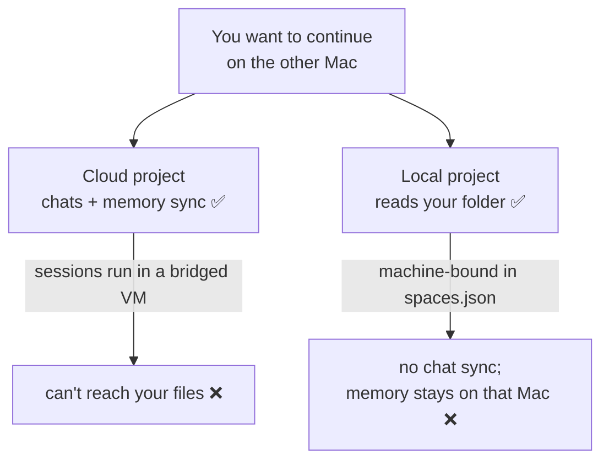
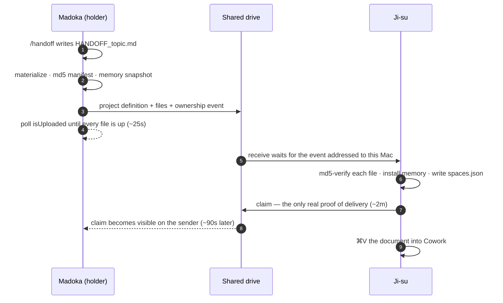

<div align="center">

# claude-macos-mirror

### Move a Claude **Cowork** workload between two Macs — the files, the project, and the context — with one command per side.

<p>
  
  
  
  
  <a href="docs/findings.md"></a>
</p>

### Attach a local folder to a Cowork project and it becomes machine-bound. Nothing about it crosses.

| Thing | Crosses machines? |
|---|---|
| Files in a shared-drive folder | ✅ the drive does this — no tooling needed |
| Custom Cowork skills | ✅ automatically, at the account level. Never copy them by hand |
| Cloud projects — chats, instructions, memory | ✅ server-side |
| **A project with a local folder** (`Local` badge) | ⚠️ the definition is copyable; nothing is automatic |
| **Conversations in a local project** | ❌ never — this is why the handoff document exists |
| **A local project's accumulated memory** | ❌ natively — but `send`/`receive` carry it |
| Folder links (which folder a project reads) | ❌ per-machine — but `mirror` writes them on both Macs |

<sub>Two commands move the rest: `mirror send` on one Mac, `mirror receive` on the other, each blocking until the transfer is <b>provable</b>. One Cowork skill, `/handoff`, writes the document that carries the context — the half no CLI can produce, because it lives in the conversation.</sub>

</div>

---

## Contents

- [Quick start](#quick-start)
- [The problem](#the-problem)
- [What this does — and doesn't](#what-this-does--and-doesnt)
- [How a handoff works](#how-a-handoff-works)
- [Setup](#setup) — [per machine](#1-once-per-machine) · [the skill](#2-once-for-the-skill) · [per project](#3-once-per-project)
- [The daily loop](#the-daily-loop)
- [Locking a machine out (`--hold`)](#locking-a-machine-out---hold)
- [Commands](#commands)
- [Layout](#layout)
- [Expectations](#expectations)
- [Troubleshooting](#troubleshooting)

---

## Quick start

```bash
git clone git@github.com:altsang/claude-macos-mirror.git ~/workspace/claude-macos-mirror
cd ~/workspace/claude-macos-mirror && ./bin/mirror deploy    # on both Macs
./bin/mirror migrate "Quicken Reconciliation"                # once, on the Mac that has it
```

Then, forever after — leaving a machine and arriving at the other:

```bash
/handoff                                                     # in the Cowork session
./bin/mirror send "Quicken Reconciliation" --to Ji-su --wait  # on Madoka
./bin/mirror receive "Quicken Reconciliation"                 # on Ji-su, ⌘V into Cowork
```

Names throughout are the two Macs this was built and measured on: `Madoka` (desktop) and `Ji-su` (laptop).

---

## The problem

Cowork projects appear on every machine — until you attach a **local folder** to one. Then it is written into *that Mac's* `spaces.json`, gets a `Local` badge, and vanishes from the web and from your other Mac.

The trap is that the two things you need never come together:



**File access and synced context are mutually exclusive today.** That gap is what this repo fills.

So three separate things have to travel, and only the first has a native path:

- **the files** — the shared drive handles these
- **the project definition** — copyable, but nothing copies it for you
- **the context** — what you were doing and why. A local project builds real memory as you work (`Quicken Reconciliation` holds 20 files and 42 KB of it), but it sits in `Application Support` on the machine that learned it. The receiving Mac gets none of it.

---

## What this does — and doesn't

**It does not sync your files.** iCloud (or Google Drive, or Dropbox) does that. What this adds:

- **Migration** — moves a project into the shared tree and md5-verifies every file before touching the original.
- **An ownership log** — both Macs know which one holds a project, which is what prevents the conflict copies two machines editing one synced folder produce.
- **Materialization** — forces the drive to deliver file *contents*, not just names.
- **A handoff document** — the only mechanism that carries context to a machine whose project cannot sync its chats. `send` refuses to ship a project without one.
- **Folder linking without the file picker** — `mirror` writes the project's folder path itself, on both Macs.
- **Upload verification** — proof the bytes actually left this Mac, which "staged" never gave you.
- **One verb per side** — `send` and `receive`, each blocking until the transfer is provable, instead of a sequence of commands none of which could confirm the others' work.
- **Diagnostics** for the failure modes that are silent and confusing, chiefly symlinked folder links.

---

## How a handoff works

Two steps per side: one in Cowork, because only that session knows what you were doing, and one in a terminal, because only a terminal can prove the transfer.



<p align="center">
  
  <br/><sub>The same handoff, both sides. Neither command returns until its half is provable — rendered from the tool's own output, with the measured timings; playback compressed.</sub>
</p>

**Why the split.** A Cowork session is sandboxed to its project folder — it cannot see `fileproviderctl`, the shared `_handoff/` tree, or any CLI, so it can never verify that a transfer completed. The terminal can never write the document, because the context lives in the session. Each side does only what the other cannot, and the mechanics have exactly one implementation.

---

## Setup

### 1. Once per machine

```bash
git clone git@github.com:altsang/claude-macos-mirror.git ~/workspace/claude-macos-mirror
cd ~/workspace/claude-macos-mirror
./bin/mirror deploy
./bin/mirror check          # ✓ shared tree present  ← if ✗, the drive hasn't synced yet. Fix that first.
```

On the second machine `deploy` is optional — the engine and skill bundles live *inside* the shared tree, so the drive delivers them.

Everything hinges on one folder **both Macs can see**. iCloud Drive is the default and needs no configuration:

```
~/Library/Mobile Documents/com~apple~CloudDocs/Claude/
    Projects/PROJECT/       ← your project files; this is the folder the project reads
    _handoff/               ← engine, skill bundles, exported project definitions
```

<details>
<summary><b>Picking a different drive — and checking it's really on both Macs</b></summary>

Any synced drive works, but it has to be *mounted and signed in* on both machines. Run this on each Mac; only a path that exists on both is a candidate:

```bash
ls -d ~/Library/Mobile\ Documents/com~apple~CloudDocs \
      ~/Library/CloudStorage/* 2>/dev/null
```

A real example of why this matters — on one setup:

```
~/Library/Mobile Documents/com~apple~CloudDocs                    ✓ both Macs
~/Library/CloudStorage/GoogleDrive-altsang@gmail.com/My Drive     ✓ both Macs
~/Library/CloudStorage/GoogleDrive-agilecto@gmail.com/My Drive    ✗ desktop only
~/Library/CloudStorage/Dropbox                                    ✗ desktop only
```

Dropbox was installed and looked like a fine choice, but it isn't signed in on the laptop — it would have failed silently at the worst moment.

**iCloud Drive.** The path is identical on every Mac regardless of which Apple ID is signed in, which is why it's the default. Both Macs must be on the **same** one: `defaults read MobileMeAccounts Accounts | grep AccountID`

**Google Drive.** The path contains your account email, so find yours and point the tool at it **on each Mac**:

```bash
ls -d ~/Library/CloudStorage/GoogleDrive-*
./bin/mirror use-root "~/Library/CloudStorage/GoogleDrive-you@gmail.com/My Drive/Claude"
```

Two cautions: with more than one Google account signed in, make sure both Macs use the *same* one — the email is in the path, so two accounts are two different roots. And check Drive is **mirroring, not streaming** (Settings → "My Drive syncing options"). Streaming behaves like iCloud's dataless files; `mirror receive` handles it, but mirroring avoids the problem.

Roots do **not** have to match across machines — the folder link is per-machine. Matching paths are simply convenient: one copy-pasteable string works on both.

</details>

### 2. Once, for the skill

Claude app → **Settings → Skills → Add**, and upload `skills/handoff/SKILL.md`. Import on one Mac only; skills sync at the account level.

**`/handoff` is the only skill this installs.** The context lives in the Cowork conversation, so only that session can write the document.

<details>
<summary><b>Why <code>skills/pickup/SKILL.md</code> is in the repo but deliberately not installed</b></summary>

`mirror receive` already claims the project and puts the document on your clipboard, leaving the skill nothing mechanical to do — and a Cowork session cannot force iCloud to deliver, so it can report a folder as missing when the data is merely un-enumerated ([finding 12](docs/findings.md)). Pasting the document after `receive` is the same brief with one fewer failure mode. Upload it only if you want the prerequisite ritual.

</details>

### 3. Once per project

On the Mac that already has the project:

```bash
ls ~/Documents/Claude/Projects/          # find the folder name — often NOT the project name
./bin/mirror rename "Finances" "Quicken Reconciliation"   # if they differ, fix it now
./bin/mirror migrate "Quicken Reconciliation"
```

`migrate` copies into the shared tree, verifies every file by md5, then moves the original aside as `.PROJECT.pre-icloud-TIMESTAMP`. Nothing moves if verification fails, and the original is never deleted. **No symlink is created** — see below.

Then put it on the second Mac. There is no separate export/import step:

```bash
./bin/mirror send "Quicken Reconciliation" --to Ji-su --no-doc   # on Madoka
./bin/mirror receive "Quicken Reconciliation"                    # on Ji-su, with Claude QUIT
```

`--no-doc` because a first move usually has no handoff document yet; drop it once there is one. `receive` writes Ji-su's project definition **and its folder link**, so there is no picker step on the second Mac. Relaunch Claude and the project is ready to read.

```bash
./bin/mirror check      # granted folders that will fail in Cowork:  none ✓
```

> ### ⚠️ Link the shared path — never a symlink
> Do not point a project at `~/Documents/Claude/Projects/PROJECT` even if it exists and resolves to the right place. Cowork registers a symlinked folder as connected — `get_device_info` reports it, the UI shows it attached — and then fails **every** read inside it with *"is not inside a folder connected to Cowork on this device."* Because it looks fine, the error points nowhere near the cause. `./bin/mirror check` flags any project in this state and prints the repair command.

<details>
<summary><b>What the folder link actually is — and why Claude must be quit</b></summary>

One field: `folders[].path` on the project's entry in `spaces.json`. There is no token, bookmark or consent record anywhere else — a UI-attached project and a `mirror`-written one have byte-identical structure. The app seeds each new session's connected scope from that field, which is why writing it is a complete grant and not half of one.

Verified 2026-08-20: `Adobe Stock Plan` was linked on both Macs by `mirror` alone, the folder picker never opened, and Cowork read its files on the receiving Mac.

**Claude must be quit while it is written.** A running app rewrites `spaces.json` from memory on exit and silently discards the change. `project-import` and `project-repath` refuse to run otherwise; `migrate` degrades to printing the command for you.

**If you ever do need the picker** — for a project `mirror` doesn't manage, or to attach a second folder by hand — `./bin/mirror path "PROJECT"` prints the exact path *and copies it to the clipboard*; in the app open the project → **Add folder** → **⌘⇧G** → paste → Return → Open. ⌘⇧G is unavoidable because you cannot browse there: Finder hides `~/Library` and relabels `Mobile Documents/com~apple~CloudDocs` as **"iCloud Drive"**, so the folder named "Mobile Documents" is not there to click.

Use the **`Local`**-badged project for file work. Cloud projects run their sessions in a bridged VM that can't reach these paths.

</details>

---

## The daily loop

| Where | Step | What it guarantees |
|---|---|---|
| Cowork, on the Mac you're leaving | `/handoff` | Writes `HANDOFF_TOPIC.md` into the project folder and stops. That document is the whole payload — a local project cannot sync its chats, so anything you knew and didn't write down is lost here |
| Terminal, same Mac | `mirror send "P" --to Ji-su --note "…" --wait` | Materializes the folder, exports the project definition, writes an md5 manifest, snapshots memory, records the ownership event naming your document — then blocks until every file reports `isUploaded`, and with `--wait` until the other Mac claims it |
| Terminal, other Mac | `mirror receive "P"` | Waits for the event addressed to *this* Mac, pulls and **md5-verifies every file**, defines the project here if this Mac has never seen it (the one step that needs Claude quit), claims it, prints the handoff document and copies it to the clipboard |
| Cowork, other Mac | **⌘V** | The brief, in front of the session that has to act on it |

`send` refuses to ship a project with no `HANDOFF*.md` — `--no-doc` overrides. Shipping files without the reasoning behind them is the failure this repo exists to prevent. `receive` refuses to claim a project that was not handed to this machine.

**Memory travels too.** `send` snapshots the holder's per-project memory store into `.handoff/memory/`, md5-manifested and upload-verified with everything else; `receive` installs it — but **only into an empty store**. A store this Mac has built is never overwritten silently (`mirror memory-install "P" --force` replaces it, backing yours up first), and a Mac never installs its own snapshot coming home. So the receiving session starts with everything the sending one learned, and the document goes back to being the baton: status and next actions, not background.

<details>
<summary><b>Proving the mirror is real, not merely present</b></summary>

```bash
./bin/mirror check        # shared root, engine, broken or symlinked folder links
./bin/mirror status       # who owns what
./bin/mirror conflicts    # must report nothing
```

Same digest on both Macs:

```bash
cd "$(./bin/mirror path 'Quicken Reconciliation')" \
  && find . -type f ! -name '.DS_Store' ! -path './.handoff/*' -exec md5 -q {} \; -print \
  | paste - - | sort | md5
```

</details>

---

## Locking a machine out (`--hold`)

The ownership log records who holds a project; it cannot stop you editing the copy that stays on this Mac. `--hold` can:

```bash
./bin/mirror send "Quicken Reconciliation" --to Ji-su --note "…" --hold
```

Two `spaces.json` writes, both per-machine, both reversed by `mirror receive` when the project comes home:

| Write | Effect |
|---|---|
| A notice in the project's `instructions` | A local project's instructions land verbatim in the session's `systemPrompt` (verified 2026-08-20), so every session you start here reads *"CHECKED OUT TO Ji-su … refuse and say the project is checked out"* before you type a word |
| `folders[]` emptied | A session that ignores the notice still cannot read a byte |

The banner is wrapped in `<!-- mirror:hold -->` markers that `project-export` and `project-import` always strip, so "checked out to Ji-su" can never travel *to* Ji-su.

Both are `spaces.json` writes, so Claude must be quit — one quit covers both. If it's running, `send` completes the transfer and prints `mirror hold "PROJECT" --to Ji-su` to run afterwards. `mirror release "PROJECT"` undoes it by hand; `receive` does it for you.

**What it does not cover:** anything outside Cowork — Finder, Excel, Quicken. Nothing in iCloud offers a lock, and locking the files themselves would block the sync daemon from writing the other Mac's changes back, which is worse than the problem.

---

## Commands

```bash
./bin/mirror send "PROJECT" --to Ji-su --note "…" --wait   # hand the project over, verified
./bin/mirror receive "PROJECT"                             # claim it here, verified

./bin/mirror deploy                                        # install the engine into the shared tree
./bin/mirror use-root "<path>"                             # use a drive other than iCloud
./bin/mirror migrate "PROJECT"                             # move a project into the shared tree
./bin/mirror rename "Old" "New"                            # rename folder + project together

./bin/mirror status                                        # every project, who owns it
./bin/mirror log "PROJECT"                                 # the ownership log
./bin/mirror check                                         # broken or symlinked folder links
./bin/mirror conflicts                                     # iCloud conflict copies (reports only)
./bin/mirror path "PROJECT"                                # print the path, copy it to the clipboard
./bin/mirror materialize "$(./bin/mirror path 'PROJECT')"  # force the drive to deliver contents

./bin/mirror hold "PROJECT" --to Ji-su                     # lock this Mac out
./bin/mirror release "PROJECT"                             # undo it
./bin/mirror memory-install "PROJECT" --force              # take their memory, backing up yours
```

The flags worth knowing on the daily pair:

| Flag | On | Effect |
|---|---|---|
| `--note "…"` | `send` | one line recorded in the ownership log; what `mirror status` shows |
| `--wait` | `send` | after the upload, block until the other Mac claims it |
| `--doc FILE` | `send` | name the document explicitly instead of taking the newest `HANDOFF*.md` |
| `--no-doc` | `send` | ship files with no context — for a first move, or a folder that isn't a project |
| `--hold` | `send` | lock this Mac out of the project until it comes back |
| `--force` | `send` | send a project the log says this Mac doesn't hold. Check `mirror log` first |
| `--timeout N` | both | seconds for the whole wait (default 900) |

<details>
<summary><b>The pieces underneath <code>send</code> and <code>receive</code></b></summary>

`handoff`, `pickup`, `project-export`, `project-import` and `wait` still exist and still work as separate verbs — `send` and `receive` are those, composed, with the verification that was missing.

```bash
./bin/mirror project-export "PROJECT"           # on the holder
./bin/mirror project-import "PROJECT" --wait    # on the receiver, with Claude QUIT
```

`--wait` blocks until both halves have crossed: the definition (a few hundred bytes, arrives first) and then the files, md5-verified against the manifest. That second half matters because iCloud delivers files *dataless* — listed at full size with no content — and only a read materializes them. Import without waiting and Cowork opens a project whose files read empty, with nothing on screen to say why. Nothing is written to `spaces.json` unless every file verifies.

`project-repath "PROJECT" "<path>"` rewrites just the folder link; `project-list` prints what this Mac knows about.

</details>

---

## Layout

```
~/Library/Mobile Documents/com~apple~CloudDocs/Claude/
    Projects/PROJECT/                              shared files  ← the project reads THIS path
    Projects/PROJECT/HANDOFF_topic.md              the context, written by /handoff
    Projects/PROJECT/.handoff/events/              append-only ownership log
    Projects/PROJECT/.handoff/memory/TS-MACHINE/   memory snapshots, md5-manifested
    _handoff/bin/coworkctl-v7.sh                   engine (versioned — never edited in place)
    _handoff/projects/PROJECT.TS.json              exported project definitions, one per send
    _handoff/projects/PROJECT.TS.manifest.json     sizes + md5s, what receive verifies against
    _handoff/{handoff,pickup}.skill                importable skill bundles
```

Releases are new files, never edits: the drive does not reliably propagate an in-place modification of a file the other Mac has already read. Callers resolve `coworkctl-v*.sh | sort -V | tail -1`.

This repo lives **outside** the shared drive — a `.git` directory in a synced folder is the same two-writer hazard that produces conflict copies.

---

## Expectations

**It is not synchronous.** Measured on a live handoff, 2026-08-20 — 21.6 KB of project across iCloud between these two Macs:

| Leg | Measured |
|---|---|
| `send` → every file confirmed `isUploaded` | **25s** (5 files, 21.6 KB) · 56s for 10 MB · ~110s for 25 MB |
| `send` → receiving Mac has verified and written its `claim` | **2m12s** · 2m46s in the 10 MB run |
| that `claim` becoming visible back on the sender | **~90s** further |

Upload scales with size and you can watch it. Delivery to an idle peer runs ~2–3 minutes almost regardless of size — the latency is the drive noticing, not the bytes moving.

- **Uploaded ≠ delivered.** `send` proves the bytes left this Mac; only the claim event proves they landed. `send --wait` waits for it.
- **One machine edits at a time.** That's what the ownership log is for.
- **The document is the deliverable.** Files arrive on their own. Put the numbers in it.

---

## Troubleshooting

| Symptom | Cause | Fix |
|---|---|---|
| *"is not inside a folder connected to Cowork"*, folder looks attached | the link points at a **symlink** | `mirror check`, then `mirror project-repath PROJECT "$(mirror path PROJECT)"` with Claude quit |
| A file reads empty, no error | evicted/dataless — contents still in the cloud | read it again; `mirror materialize`. `du` and `.icloud` checks cannot see this |
| Nothing arrives on the other Mac | it's asleep, or you didn't enumerate | `ssh peer 'uptime; pmset -g ps'`; list the whole parent chain, not just the leaf |
| `(name) 2.ext` files appearing | two writers to one synced path | `mirror conflicts` (reports only), remove by exact path — **never** by glob |
| A Cowork session says the project has no `.handoff` directory | uploaded, but never enumerated on this Mac — and a sandboxed session cannot force the drive to deliver | `mirror receive "P"` — its wait loop lists the whole parent chain, which is what makes iCloud hand it over |
| `/handoff` tries to do the transfer itself | old skill version registered | re-upload `skills/handoff/SKILL.md`; the current one writes the document and stops |
| Skill upload rejected, "cannot have XML tags" | angle-bracket placeholders in `SKILL.md` | use bare words, not `<Project>` |
| Project missing on the other Mac | local projects don't sync | `mirror send "P" --to MACHINE --no-doc`, then `mirror receive "P"` |
| Not sure the files actually reached iCloud | `handoff` only staged them; nothing verified the upload | `mirror send` — it polls `isUploaded` until every file is up |
| `receive` says memory "NOT overwriting" | this Mac already built its own store — the guardrail, not an error | keep yours (do nothing), or `mirror memory-install "P" --force` to take theirs; yours is backed up first |

[**docs/findings.md**](docs/findings.md) has the measurements behind each of these, and the two commands that destroyed data during development.
